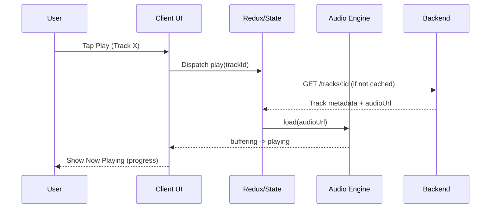
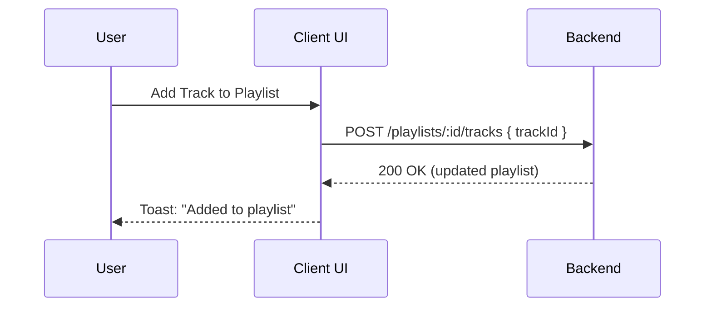
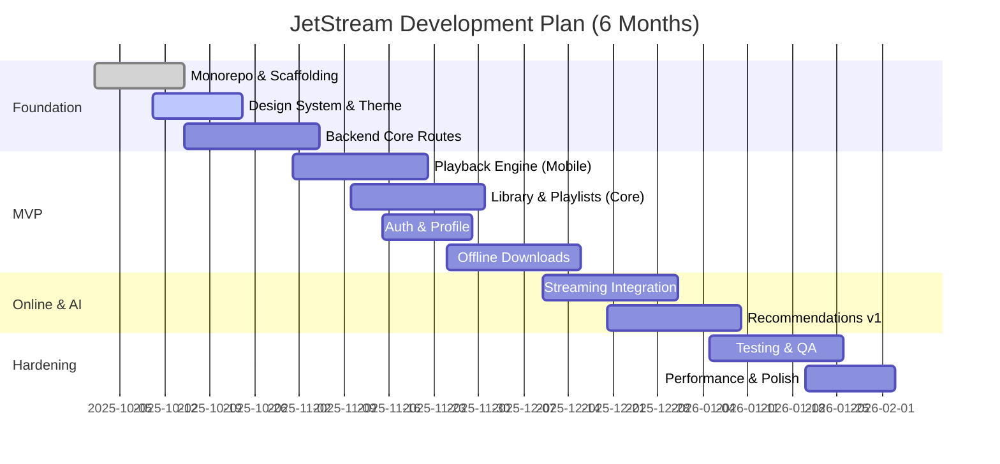
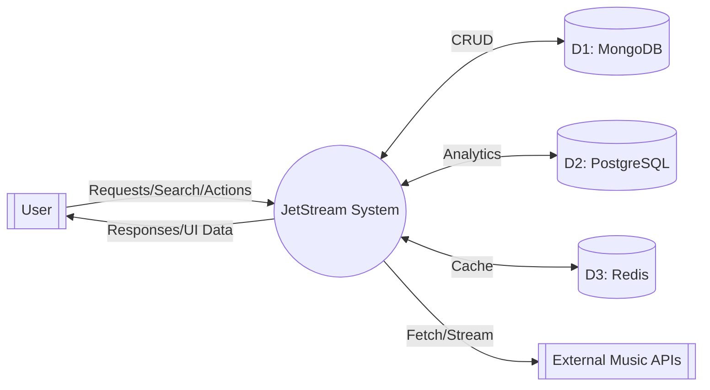
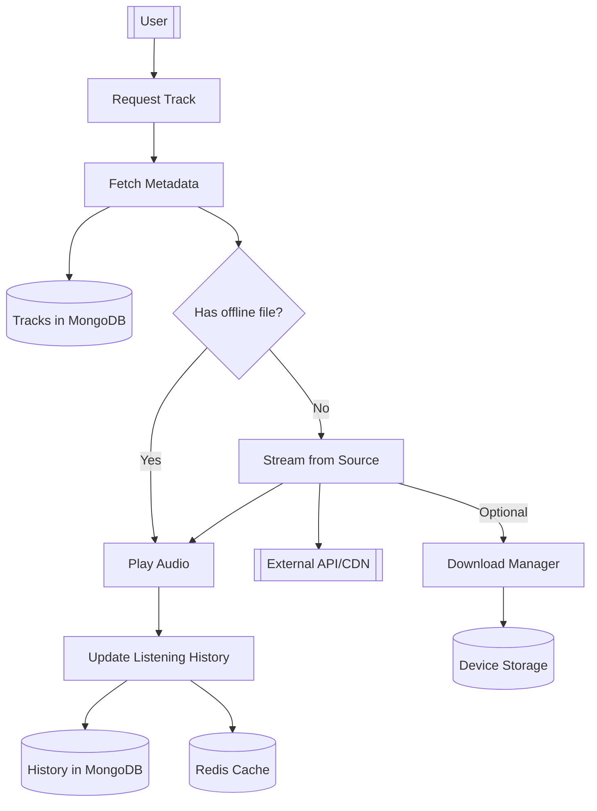
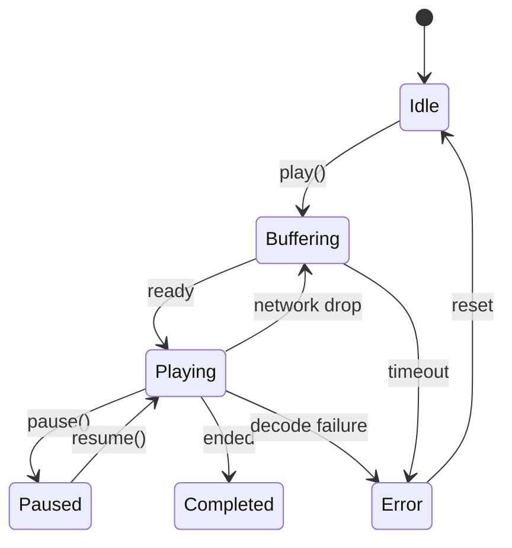
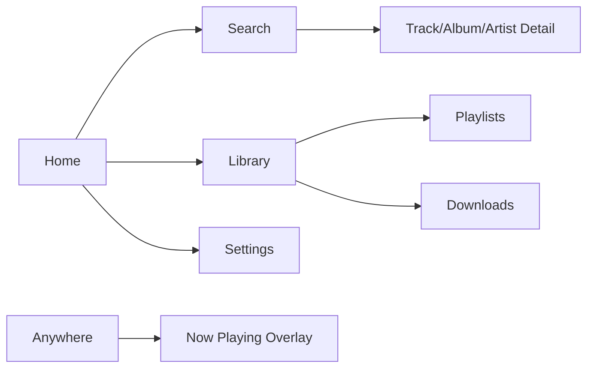
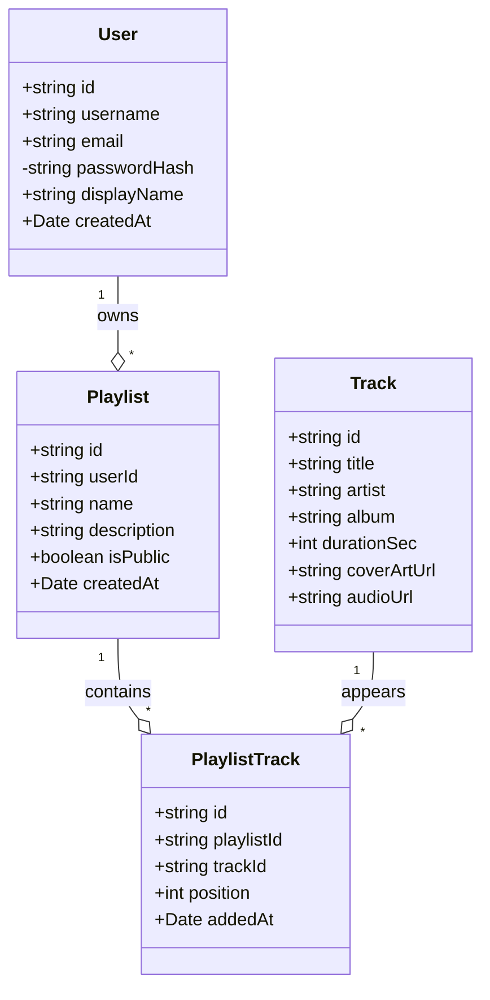

# JetStream — Comprehensive Project Proposal Details

Last updated: 2025-10-31

> This document compiles all proposal-style details for the JetStream project, aligned to common academic proposal templates (problem, objectives, scope, architecture, requirements, data model, diagrams, plan, risks, testing, and references). Where figures are needed, Mermaid code is provided so you can render them directly in supported viewers. If your course requires a different section order or additional sections, let us know and we’ll tailor it.

---

## 0. Proposal Template Compliance (CSE412)

This document maps to typical CSE412 proposal sections:

- Title & Team → Section 1
- Abstract → Section 2
- Introduction/Background → Section 3+4 combined; extended in Section 3A
- Problem Statement & Motivation → Section 3
- Objectives (General/Specific) → Section 4
- Scope → Section 5
- Literature Review / Related Work → Section 3B
- System Requirements (FR/NFR) → Section 8
- Methodology/Modules → Section 11.0A
- Use Case Diagram → Section 11.0B
- Data Flow Diagram (DFD Level 0/1) → Section 11.0C
- ER Diagram → Section 9.1
- Architecture/Component/Deployment Diagrams → Sections 7.1, 11.1, 16
- State Diagram (Player) → Section 11.0D
- UI Sitemap/Wireframes → Section 11.0E
- Implementation Plan / Gantt → Section 13.1
- Feasibility Study → Section 14A
- Risk Analysis → Section 14
- Resources & Budget → Section 16A
- Team Roles / RACI / Communication → Section 18A
- Deliverables & Milestones → Section 13.2
- Testing & Evaluation → Section 15
- Conclusion → Section 20
- References → Section 19

## 1. Title and Team

- Project Title: JetStream — A Versatile, Lightweight Offline+Online Music Player
- Course: CSE412
- Semester: Fall 2025
- Team: Group X (update with names, IDs, emails)

## 2. Abstract

JetStream is a cross-platform music player designed to deliver seamless online streaming alongside robust offline playback. It features a minimalistic dark UI, privacy-first architecture, and advanced capabilities including AI-powered recommendations and optional blockchain integration for ownership and decentralized sharing. The system includes a React Native mobile app (Expo), a React web client, and a Node.js/Express backend with MongoDB/PostgreSQL, Redis caching, and optional Web3 modules. This proposal details the problem motivation, objectives, scope, system architecture, requirements, data model, APIs, security, project plan, risks, and testing strategy.

## 3. Problem Statement

Modern music apps often trade privacy and offline reliability for convenience. Users face: limited offline access, fragmented ecosystems, opaque recommendation systems, and privacy concerns. JetStream addresses these by:
- Prioritizing offline-first playback and library management
- Offering transparent, on-device and server-side AI recommendations
- Providing a clean, fast UI with low resource usage
- Enabling cross-platform access and optional decentralized features

### 3A. Introduction & Background

Music consumption has shifted toward streaming services with heavy server-side personalization and vendor lock-in. However, many regions and users face unreliable connectivity and privacy concerns. Offline-first design patterns, combined with transparent recommendation logic and open-source development, address these pain points. JetStream builds on proven technologies—React Native for rapid cross-platform deployment, Node/Express for a robust API layer, and MongoDB/PostgreSQL for flexible and analytical storage—while enabling future research directions (on-device ML, federated learning, and decentralized catalogs).

### 3B. Literature Review / Related Work

- Spotify Client and Web API: industry benchmark for recommendation-driven UX; highlights scalability and data considerations.
- ExoPlayer/Expo AV: reference implementations for low-latency audio playback on mobile; informs codec and buffering strategies.
- Web Audio API: browser-based audio processing; supports visualizations and effects pipelines for the web client.
- Recommender Systems (Matrix Factorization, Neural CF): informs initial history-based recommendations and scoring approaches.
- NFTs and Music Ownership (Web3): opportunities and risks for verifiable ownership and creator royalties; included as future scope.

## 4. Objectives

- Functional
  - Seamless playback: play, pause, seek, queue, repeat/shuffle
  - Offline-first: download, store, and play without connectivity
  - Library and playlists: create, edit, share
  - Search and browse: local and online catalogs
  - Personalized recommendations (v1)
  - User profiles and authentication
- Non-functional
  - Performance: <2s cold start; 60fps animations where applicable
  - Size: ~<50MB mobile install; efficient network/cpu/battery
  - Reliability: graceful offline behavior; retry and caching
  - Security: JWT auth, rate limiting, encryption-in-transit, least privilege
  - Scalability: horizontal backend scale; CDN caching; DB indexing

## 5. Scope

- In-Scope (MVP)
  - React Native mobile app (Expo) and Web client (React/Vite)
  - Backend API (Node/Express) with MongoDB + PostgreSQL
  - Core playback and offline downloads (mobile-first)
  - Basic recommendations (history-based)
  - Library, playlists, search, user auth
- Near-term (Post-MVP)
  - Cloud sync; richer recommendations; improved analytics
- Future
  - Blockchain/NFT ownership; AR/VR; plugin ecosystem; desktop app

## 6. Stakeholders and Personas

- End users: students, commuters, audiophiles, travelers
- Admin/ops: maintains backend, monitors health and analytics
- Contributors: open-source developers extending themes/plugins

## 7. High-Level System Overview

- Clients: Mobile (React Native/Expo), Web (React)
- Backend: Node.js/Express with MongoDB, PostgreSQL, Redis
- Storage: Local device (offline), cloud object store (future), optional IPFS
- AI: TensorFlow.js based recommendation (server-side, optional client-side)
- Optional: Web3 integrations (Ethereum via web3.js)

### 7.1 System Context Diagram (Mermaid)

```mermaid
flowchart LR
  subgraph Users
    U[User]
  end

  subgraph Clients
    M[Mobile App (React Native/Expo)]
    W[Web App (React/Vite)]
  end

  subgraph API[Backend API (Node.js/Express)]
    A[Auth Service]
    T[Track Service]
    P[Playlist Service]
    R[Recommendation Service]
    Ux[User Profile Service]
  end

  subgraph Data[Data Layer]
    MG[(MongoDB)]
    PG[(PostgreSQL)]
    RD[(Redis Cache)]
  end

  subgraph External[External/Optional]
    SPT[(Streaming APIs)]
    S3[(Object Storage / CDN)]
    IPFS[(IPFS)]
    ETH[(Blockchain / Web3)]
  end

  U <-->|Use| M
  U <-->|Use| W
  M <--> API
  W <--> API
  API <--> MG
  API <--> PG
  API <--> RD
  T --> SPT
  T --> S3
  R --> PG
  R --> MG
  P --> S3
  ETH -. optional .- API
  IPFS -. optional .- API
```

## 8. Requirements

### 8.1 Functional Requirements (FR)

- FR-1: User registration/login (JWT); profile management
- FR-2: Search tracks/artists/albums; browse categories
- FR-3: Playback controls (play/pause/seek/skip/repeat/shuffle)
- FR-4: Queue management (enqueue/dequeue/reorder)
- FR-5: Offline downloads (mobile); list and delete downloaded items
- FR-6: Library: like/save tracks, manage playlists (CRUD)
- FR-7: Recommendations endpoint returns personalized track lists
- FR-8: Settings: theme, quality, download preferences
- FR-9: Error and rate limit responses follow standard schema

### 8.2 Non-Functional Requirements (NFR)

- NFR-1 Performance: cold start <2s (web), <3s (mobile); steady 60fps UI
- NFR-2 Reliability: recover from network drops; retry/backoff; offline cache
- NFR-3 Security: TLS in transit; JWT; bcrypt for passwords; rate limiting
- NFR-4 Scalability: stateless API; horizontal scale; DB indexes; Redis caching
- NFR-5 Maintainability: typed code (TypeScript); lint/format/test pipelines
- NFR-6 Usability: minimalistic dark theme; accessible contrasts and sizes

## 9. Data Design

### 9.1 ER Diagram (Mermaid)

```mermaid
erDiagram
  USER ||--o{ PLAYLIST : owns
  USER ||--o{ LISTENING_HISTORY : logs
  USER ||--o{ SESSION : has
  PLAYLIST ||--o{ PLAYLIST_TRACK : contains
  TRACK ||--o{ PLAYLIST_TRACK : appears_in
  TRACK ||--o{ LISTENING_HISTORY : is_played
  RECOMMENDATION ||--o{ RECOMMENDATION_ITEM : contains
  USER ||--o{ RECOMMENDATION : receives

  USER {
    string id PK
    string username
    string email
    string passwordHash
    string displayName
    date createdAt
  }
  TRACK {
    string id PK
    string title
    string artist
    string album
    int durationSec
    string coverArtUrl
    string audioUrl
  }
  PLAYLIST {
    string id PK
    string userId FK
    string name
    string description
    boolean isPublic
    date createdAt
  }
  PLAYLIST_TRACK {
    string id PK
    string playlistId FK
    string trackId FK
    int position
    date addedAt
  }
  LISTENING_HISTORY {
    string id PK
    string userId FK
    string trackId FK
    date playedAt
    int progressSec
    string device
  }
  SESSION {
    string id PK
    string userId FK
    date issuedAt
    date expiresAt
    string deviceInfo
  }
  RECOMMENDATION {
    string id PK
    string userId FK
    string strategy // e.g., "history", "mood"
    float confidence
    date generatedAt
  }
  RECOMMENDATION_ITEM {
    string id PK
    string recommendationId FK
    string trackId FK
    float score
  }
```

### 9.2 Data Considerations

- Indexes: userId on playlists/history; composite index on playlistId+position; createdAt for pagination
- Storage: audio/coverArt via CDN/S3 or local dev; downloads via device file system (mobile)
- Caching: Redis keys for hot tracks, user recs, and rate limiting buckets

## 10. API Overview

- Base URL: `http://localhost:5000/api`
- Auth: JWT in `Authorization: Bearer <token>`
- Refer to `docs/API.md` for full request/response schemas.

Key endpoints:
- Auth: POST `/auth/register`, `/auth/login`
- Tracks: GET `/tracks`, GET `/tracks/:id`, POST `/tracks/search`
- Playlists: GET/POST `/playlists`, PUT/DELETE `/playlists/:id`
- Recommendations: GET `/recommendations/tracks`
- Users: GET `/users/profile`, PUT `/users/profile`

## 11. Detailed Design

### 11.1 Component Diagram (Mermaid)

```mermaid
graph TB
  subgraph Mobile[Mobile (RN/Expo)]
    MUI[UI Layer]
    MState[Redux Store]
    MAudio[Audio Engine]
    MAPI[API Client]
    MStorage[Local Storage]
  end
  subgraph Web[Web (React/Vite)]
    WUI[UI Layer]
    WState[Redux Store]
    WAPI[API Client]
  end
  subgraph Backend[Express API]
    Auth[Auth Controller]
    Tracks[Tracks Controller]
    Playlists[Playlists Controller]
    Recs[Recommendations Controller]
    Users[Users Controller]
    MW[Security & RateLimit Middleware]
  end
  DB1[(MongoDB)]
  DB2[(PostgreSQL)]
  Cache[(Redis)]

  MUI-->MState
  MUI-->MAudio
  MUI-->MAPI
  MAPI<-->Backend
  MStorage-->MAudio

  WUI-->WState
  WUI-->WAPI
  WAPI<-->Backend

  Backend<-->DB1
  Backend<-->DB2
  Backend<-->Cache
```

### 11.2 Playback Sequence (Mermaid)



### 11.3 Add-to-Playlist Sequence (Mermaid)



### 11.4 Recommendation Activity (Mermaid)

```mermaid
flowchart TD
  A[Start] --> B[Collect listening history]
  B --> C[Extract features (artist, tempo, recency, skips)]
  C --> D[Model scoring (TF.js)]
  D --> E{Confidence >= threshold?}
  E -- Yes --> F[Return top-N recommendations]
  E -- No --> G[Hybrid: fallback to trending/genre-based]
  F --> H[Cache in Redis]
  G --> H
  H --> I[Display in UI]
  I --> J[End]
```

## 12. Security

- TLS/HTTPS for all traffic; HSTS (prod)
- JWT auth; refresh token rotation (optional extension)
- Password hashing: bcrypt
- Input validation and centralized error handling
- Rate limiting (per IP and per token); CORS configured
- Secrets via environment variables; least-privilege DB credentials

## 13. Implementation Plan and Timeline

### 13.1 Phases and Milestones (Mermaid Gantt)



### 13.2 Deliverables & Milestones

- D1: Project proposal and architecture pack (this document + diagrams)
- D2: Backend MVP (Auth, Tracks, Playlists, Recommendations endpoints)
- D3: Mobile MVP (Playback, Library, Offline downloads)
- D4: Web MVP (Browse, Search, Basic player)
- D5: Testing pack (unit/integration), performance report, and demo
- D6: Final report and presentation slides

## 14. Risk Analysis and Mitigations

| Risk | Impact | Likelihood | Mitigation |
|------|--------|------------|------------|
| Audio engine platform quirks | Medium | Medium | Use Expo AV with tested codecs; fallback formats; feature flags |
| API rate limits/external APIs | Medium | Medium | Cache, backoff, local mock data, queueing |
| Offline storage limits | Low | Medium | Configurable download caps; cleanup policies |
| Data privacy/compliance | High | Low | Minimal PII; transparent policies; opt-in analytics |
| Scope creep | Medium | Medium | Strict MVP; backlog grooming; timeboxing |

### 14A. Feasibility Study

- Technical Feasibility: High. Stack is standard (React Native, React, Node, MongoDB/PostgreSQL). Audio playback supported by Expo AV; caching and offline storage supported via Expo FileSystem/SQLite.
- Economic Feasibility: High for academic scope. Uses open-source tooling and free tiers. Optional cloud costs minimal in development.
- Operational Feasibility: High. Clear roles and modular architecture reduce coordination overhead; documentation and scripts available.

## 15. Testing Strategy

- Unit tests: reducers, utility functions, controllers
- Integration tests: API endpoints (Jest + Supertest)
- UI tests: React Native Testing Library; snapshot and basic interactions
- Manual QA: test matrices across devices, network profiles, offline/online transitions
- Performance checks: cold start timings, FPS profiling, API latency

## 16. Deployment Strategy

- Dev: local environments; `.env` based config
- Prod: containerized API; load balancer; CDN for static assets
- DB: managed MongoDB/PostgreSQL; backup/restore; monitoring
- CI/CD: lint, format, test gates; tagged releases

### 16A. Resources & Budget (Indicative)

- Hardware: Developer laptops; optional Android/iOS devices for testing
- Software: Node.js, VS Code, Expo, MongoDB/Postgres (local), Jest — all free
- Cloud (optional during demo): small VM or PaaS; object storage (S3 free tier) — $0–$20
- Time: ~6 person-months total for MVP (team of 4 over 2 months)

## 17. Ethical and Legal Considerations

- Respect copyrights and licensing; integrate only legal sources
- Transparent data usage; opt-in analytics and recommendations
- Accessibility: contrast ratios, larger touch targets, screen reader labels

## 18. Project Management

- Repo structure: see `STRUCTURE.md`
- Issue tracking: GitHub Issues/Projects
- Conventions: Conventional Commits, Prettier, ESLint, TypeScript strict

### 18A. Team Roles & Communication

- Roles: Lead Developer, Backend Engineer, Mobile/Web Engineer, QA/Docs
- Responsibilities (RACI):
  - Architecture (R: Lead Dev; A: Team; C: Backend/Mobile; I: All)
  - Backend APIs (R: Backend; A: Lead Dev; C: Mobile/Web; I: QA)
  - Mobile Player (R: Mobile; A: Lead Dev; C: Backend; I: QA)
  - Web Client (R: Web; A: Lead Dev; C: Backend; I: QA)
  - Testing & Docs (R: QA/Docs; A: Lead Dev; C: All; I: Stakeholders)
- Communication: Weekly standup, mid-week async updates; Issue tracker for tasks; Milestone reviews at each deliverable

## 19. References

- Internal docs: `README.md`, `PROJECT_SUMMARY.md`, `docs/ARCHITECTURE.md`, `docs/API.md`, `docs/GETTING_STARTED.md`
- Libraries: React Native, Expo, Redux Toolkit, Express, MongoDB, PostgreSQL, Redis, TensorFlow.js, Web3.js
- Design: Material guidelines, WCAG 2.1 AA

---

## Appendix A: Glossary

- Offline-first: Design that ensures core features work without network
- RBAC: Role-Based Access Control
- CDN: Content Delivery Network

## Appendix B: How to Render Diagrams

- Many Markdown renderers support Mermaid directly. If not, paste the Mermaid blocks into an online Mermaid viewer.
- Draw.io is optional; Mermaid was chosen for portability. If you need .drawio XML exports, we can provide them on request.

---

## 11.0A Methodology and Modules

- Client Apps: UI components, Redux state, services (Audio, API, Storage)
- Backend Services: Auth, Tracks, Playlists, Recommendations, Users
- Data Layer: MongoDB (users, tracks, playlists), PostgreSQL (analytics), Redis (cache)
- Offline Module: Download manager, storage quota, cleanup policies (mobile)
- Observability: Logging (morgan), health checks, rate limiting

## 11.0B Use Case Diagram (UML-style using Mermaid)

```mermaid
flowchart TD
  U[User]
  subgraph UseCases
    UC1((Register/Login))
    UC2((Search Music))
    UC3((Play/Pause/Seek)))
    UC4((Manage Queue))
    UC5((Download for Offline))
    UC6((Manage Playlists)))
    UC7((Get Recommendations))
    UC8((Edit Profile/Settings))
  end
  U --> UC1
  U --> UC2
  U --> UC3
  U --> UC4
  U --> UC5
  U --> UC6
  U --> UC7
  U --> UC8
```

## 11.0C Data Flow Diagrams (DFD)

### Level 0 (Context Level)



### Level 1 (Playback & Download Subsystem)



## 11.0D Player State Diagram



## 11.0E UI Sitemap (Navigation)



## 11.0F Backend Class Diagram (Models)



## 20. Conclusion

JetStream targets a gap between convenience and control: a cross-platform, offline-first music player with transparent recommendations and privacy by design. The architecture and plan outlined here are feasible within the course timeline and rely on widely adopted, well-documented technologies. The modularity enables incremental delivery (MVP first), with clear pathways to advanced features (AI, Web3, AR/VR) as time permits.
